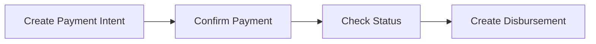

Get started with the Yabetoo API in minutes using our official Postman collection. No code required.

## Download Files

Download the collection and environment files from our GitHub repository:

<CardGroup cols={3}>
  <Card title="API Collection" icon="download" href="https://github.com/yabetoo/docs/raw/main/public/postman/Yabetoo-API.postman_collection.json">
    All endpoints
  </Card>
  <Card title="Sandbox Env" icon="flask" href="https://github.com/yabetoo/docs/raw/main/public/postman/Yabetoo-Sandbox.postman_environment.json">
    Test config
  </Card>
  <Card title="Production Env" icon="rocket" href="https://github.com/yabetoo/docs/raw/main/public/postman/Yabetoo-Production.postman_environment.json">
    Live config
  </Card>
</CardGroup>

## Quick Start

<Steps>
  <Step title="Download the Files">
    Click the download buttons above to get:
    - **Yabetoo-API.postman_collection.json** - The main API collection
    - **Yabetoo-Sandbox.postman_environment.json** - Sandbox environment variables
  </Step>

  <Step title="Import into Postman">
    1. Open Postman
    2. Click **Import** (top left)
    3. Drag and drop both files or click **Upload Files**
    4. Click **Import**
  </Step>

  <Step title="Configure Your API Key">
    1. Click the **Environment** dropdown (top right)
    2. Select **Yabetoo - Sandbox**
    3. Click the **eye icon** to view variables
    4. Replace `sk_test_your_secret_key_here` with your actual test key
    5. Click **Save**
  </Step>

  <Step title="Make Your First Request">
    1. Open the **Yabetoo API** collection
    2. Navigate to **Payment Intent > Create Payment Intent**
    3. Click **Send**
    4. You should receive a `201` response with the payment intent details
  </Step>
</Steps>

## What's Included

The collection covers all Yabetoo API endpoints:

| Folder | Endpoints | Description |
|--------|-----------|-------------|
| **Checkout Session** | Create, Get | Hosted payment pages |
| **Payment Intent** | Create, Confirm, Get | Advanced payment integration |
| **Disbursement** | Create, Get | Send money to mobile accounts |
| **Remittance** | Create, Get, List | International transfers |
| **Webhook** | Create, Get, List | Payment notifications |

## Features

### Auto-saved Variables

When you create a resource, the ID is automatically saved for subsequent requests:

```javascript
// After creating a payment intent
pm.environment.set("payment_intent_id", response.id);

// The "Get Payment Intent" request automatically uses this ID
GET /v1/payment_intents/{{payment_intent_id}}
```

### Built-in Tests

Each request includes automatic validation:

```javascript
pm.test("Status code is 201", function () {
    pm.response.to.have.status(201);
});

pm.test("Response has payment intent data", function () {
    var jsonData = pm.response.json();
    pm.expect(jsonData).to.have.property('id');
    pm.expect(jsonData).to.have.property('status');
});
```

### Pre-filled Examples

All requests come with realistic example payloads:

```json
{
  "amount": 10000,
  "currency": "XAF",
  "description": "Payment for Order #12345",
  "metadata": {
    "orderId": "12345",
    "productName": "Premium Subscription"
  }
}
```

## Environments

We provide two environment configurations:

<CardGroup cols={2}>
  <Card title="Sandbox" icon="flask">
    **For testing**
    - URL: `api.sandbox.yabetoo.com`
    - Use test API keys (`sk_test_...`)
    - No real money is transferred
  </Card>
  <Card title="Production" icon="rocket">
    **For live payments**
    - URL: `api.yabetoo.com`
    - Use live API keys (`sk_live_...`)
    - Real transactions
  </Card>
</CardGroup>

<Warning>
  Never commit your API keys to version control. Use Postman's environment variables to keep them secure.
</Warning>

## Typical Workflow

Here's a common testing workflow:



1. **Create Payment Intent** - Initialize a payment
2. **Confirm Payment** - Add customer's mobile money details
3. **Check Status** - Poll or wait for webhook
4. **Create Disbursement** - Send payout (if needed)

## Test Phone Numbers

Use these test numbers in sandbox mode:

| Number | Operator | Country | Behavior |
|--------|----------|---------|----------|
| `242066000001` | MTN | Congo | Always succeeds |
| `242066000002` | MTN | Congo | Always fails |
| `242055000001` | Airtel | Congo | Always succeeds |

## Troubleshooting

<AccordionGroup>
  <Accordion title="401 Unauthorized">
    - Check that your API key is correctly set in the environment
    - Ensure you're using the right key for the environment (test key for sandbox)
    - Verify the key hasn't been revoked in your dashboard
  </Accordion>

  <Accordion title="Variable not found">
    - Make sure you've selected an environment (top right dropdown)
    - Run the "Create" request before the "Get" request to auto-populate IDs
    - Check the environment variables by clicking the eye icon
  </Accordion>

  <Accordion title="SSL Certificate Error">
    - In Postman Settings, disable "SSL certificate verification" for testing
    - This should only be done in development environments
  </Accordion>
</AccordionGroup>


## Related Resources

<CardGroup cols={2}>
  <Card title="API Reference" icon="book" href="/en/api-reference/introduction">
    Complete API documentation
  </Card>
  <Card title="Testing Guide" icon="vial" href="/en/developer-tools/test/overview">
    Test mode and sandbox details
  </Card>
</CardGroup>
