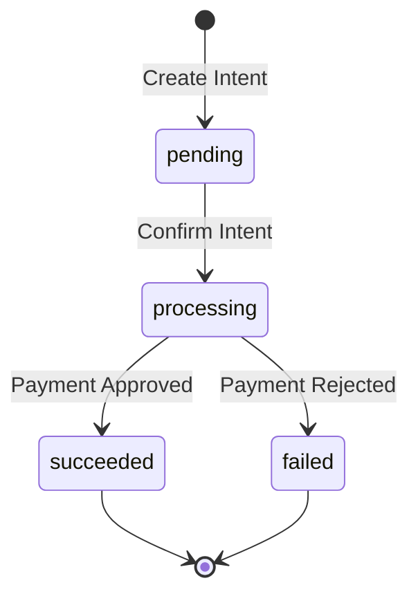

This guide explains all the statuses you'll encounter when working with payments, disbursements, and remittances in Yabetoo.

## Payment Intent Statuses

A Payment Intent goes through several statuses during its lifecycle:

| Status | Description | Next Steps |
|--------|-------------|------------|
| `pending` | Intent created, waiting for confirmation | Confirm the payment with customer details |
| `processing` | Payment being processed by Mobile Money provider | Wait for completion |
| `succeeded` | Payment completed successfully | Fulfill the order |
| `failed` | Payment failed | Check error reason, allow retry |

### Status Flow



## Checkout Session Statuses

| Status | Description |
|--------|-------------|
| `open` | Session created, waiting for customer |
| `complete` | Customer completed the payment |
| `expired` | Session expired without payment |

## Disbursement Statuses

Disbursements (payouts to customers) have the following statuses:

| Status | Description |
|--------|-------------|
| `pending` | Disbursement created, queued for processing |
| `processing` | Being sent to the recipient |
| `succeeded` | Money successfully sent to recipient |
| `failed` | Disbursement failed |

## Remittance Statuses

Remittances (transfers) follow the same pattern:

| Status | Description |
|--------|-------------|
| `pending` | Transfer queued |
| `processing` | Transfer in progress |
| `succeeded` | Transfer completed |
| `failed` | Transfer failed |

## Handling Different Statuses

### Successful Payments

When a payment reaches `succeeded`:

```javascript
if (payment.status === "succeeded") {
  // 1. Update your database
  await updateOrderStatus(orderId, "paid");

  // 2. Send confirmation to customer
  await sendConfirmationEmail(customer.email);

  // 3. Trigger fulfillment
  await fulfillOrder(orderId);
}
```

### Failed Payments

When a payment fails, check the `failure_message`:

```javascript
if (payment.status === "failed") {
  const reason = payment.failure_message;

  switch (reason) {
    case "LOW_BALANCE":
      // Ask customer to top up
      showMessage("Insufficient balance. Please top up your Mobile Money account.");
      break;
    case "APPROVAL_REJECTED":
      // Customer rejected the payment
      showMessage("Payment was cancelled. Please try again.");
      break;
    case "TIMEOUT":
      // Customer didn't respond
      showMessage("Payment timed out. Please try again.");
      break;
    default:
      showMessage("Payment failed. Please try again or use a different number.");
  }
}
```

### Processing Payments

While a payment is `processing`:

```javascript
if (payment.status === "processing") {
  // Show a waiting state to the user
  showMessage("Waiting for payment confirmation...");

  // The customer should receive a notification on their phone
  // Don't allow duplicate submissions
  disablePayButton();
}
```

## Failure Messages

When a payment fails, the `failure_message` field provides details:

| Message | Description | Recommended Action |
|---------|-------------|-------------------|
| `INTERNAL_PROCESSING_ERROR` | System error | Retry later |
| `APPROVAL_REJECTED` | Customer rejected | Ask to retry |
| `EXPIRED` | Request expired | Create new intent |
| `TIMEOUT` | No response from customer | Ask to retry |
| `PAYER_NOT_FOUND` | Invalid phone number | Verify number |
| `PAYEE_NOT_ALLOWED_TO_RECEIVE` | Recipient cannot receive | Contact support |
| `NOT_ALLOWED` | Transaction blocked | Contact support |
| `LOW_BALANCE` | Insufficient funds | Customer should top up |

## Webhook Events by Status

| Status | Webhook Event |
|--------|---------------|
| `succeeded` | `intent.completed` |
| `succeeded` (disbursement) | `disbursement.completed` |

## Best Practices

1. **Always handle all statuses** - Don't assume payments will always succeed
2. **Use webhooks for reliability** - Don't rely only on synchronous responses
3. **Log status changes** - Keep a history for debugging and support
4. **Show clear messages** - Help users understand what happened and what to do next
5. **Implement retry logic** - Allow customers to retry failed payments

<Note>
  For testing different statuses, use the [test numbers](/en/developer-tools/test/overview) in the sandbox environment.
</Note>
