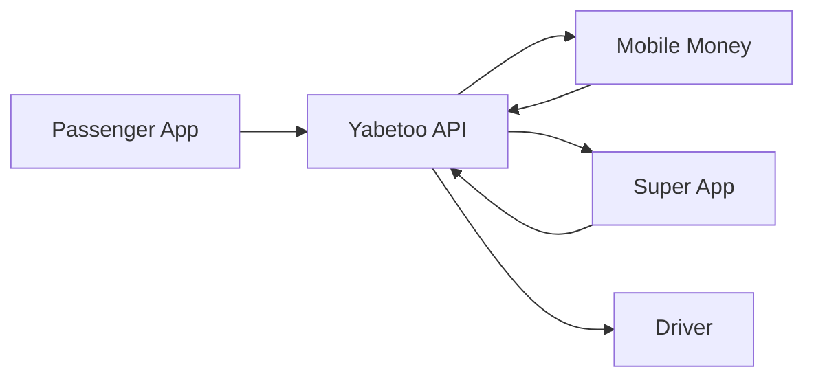

Learn how to build a complete ride-hailing platform or super app using Yabetoo, inspired by [Gozem](https://gozem.co/), Africa's super app operating across Francophone Africa. This guide covers ride payments, driver payouts, digital wallets, and multi-service integrations.

## Overview

Ride-hailing and super apps need to handle:
- Real-time ride fare calculation and payment
- Multiple vehicle types (motorcycles, cars, tricycles)
- Driver earnings and instant payouts
- Digital wallet top-ups and payments
- Multi-service transactions (rides, deliveries, groceries)
- Commission management

## Gozem's Model

[Gozem](https://gozem.co/) is Africa's super app operating since 2018, offering:
- **Transportation**: Motorcycle taxis (zémidjans), cars, tricycles
- **Delivery**: Food, groceries, e-commerce logistics
- **Financial services**: Digital wallet, cashless payments
- **Coverage**: 9+ countries including Togo, Benin, Cameroon, Congo

In Congo Brazzaville, Gozem uses Yabetoo for mobile money payment processing.

## Architecture



## Implementation

### 1. Data Models

Define ride and vehicle structures:

```typescript
// types.ts
interface Ride {
  id: string;
  passengerId: string;
  driverId?: string;
  vehicleType: 'motorcycle' | 'car' | 'tricycle';
  pickup: Location;
  dropoff: Location;
  distance: number; // in km
  duration: number; // estimated minutes
  fare: number;
  platformFee: number;
  driverEarnings: number;
  status: 'searching' | 'accepted' | 'arrived' | 'in_progress' | 'completed' | 'cancelled';
  paymentMethod: 'wallet' | 'mobile_money' | 'cash';
  paymentStatus: 'pending' | 'paid' | 'failed';
  createdAt: Date;
  completedAt?: Date;
}

interface Location {
  address: string;
  lat: number;
  lng: number;
}

interface Driver {
  id: string;
  firstName: string;
  lastName: string;
  phone: string;
  operatorName: 'mtn' | 'airtel';
  vehicleType: 'motorcycle' | 'car' | 'tricycle';
  vehiclePlate: string;
  rating: number;
  totalRides: number;
  walletBalance: number;
  status: 'online' | 'offline' | 'busy';
  currentLocation?: Location;
}

interface Wallet {
  id: string;
  userId: string;
  userType: 'passenger' | 'driver';
  balance: number;
  currency: string;
}

// Pricing configuration
const PRICING = {
  motorcycle: { baseFare: 500, perKm: 200, perMinute: 25 },
  car: { baseFare: 1000, perKm: 350, perMinute: 50 },
  tricycle: { baseFare: 750, perKm: 250, perMinute: 35 }
};

const PLATFORM_COMMISSION = 0.20; // 20% platform commission
```

### 2. Fare Calculation

Calculate dynamic fares based on distance and time:

```typescript
interface FareEstimate {
  baseFare: number;
  distanceFare: number;
  timeFare: number;
  totalFare: number;
  platformFee: number;
  driverEarnings: number;
  currency: string;
}

function calculateFare(
  vehicleType: 'motorcycle' | 'car' | 'tricycle',
  distanceKm: number,
  durationMinutes: number,
  surgeMultiplier: number = 1.0
): FareEstimate {
  const pricing = PRICING[vehicleType];

  const baseFare = pricing.baseFare;
  const distanceFare = Math.round(distanceKm * pricing.perKm);
  const timeFare = Math.round(durationMinutes * pricing.perMinute);

  const subtotal = baseFare + distanceFare + timeFare;
  const totalFare = Math.round(subtotal * surgeMultiplier);

  const platformFee = Math.round(totalFare * PLATFORM_COMMISSION);
  const driverEarnings = totalFare - platformFee;

  return {
    baseFare,
    distanceFare,
    timeFare,
    totalFare,
    platformFee,
    driverEarnings,
    currency: 'XAF'
  };
}

// Example: 5km ride, 15 minutes, by motorcycle
// calculateFare('motorcycle', 5, 15)
// → { baseFare: 500, distanceFare: 1000, timeFare: 375, totalFare: 1875, ... }
```

### 3. Wallet Top-Up

Allow passengers to top up their digital wallet:

```typescript
import Yabetoo from 'yabetoo';

const yabetoo = new Yabetoo(process.env.YABETOO_SECRET_KEY!);

async function topUpWallet(userId: string, amount: number) {
  if (amount < 500) {
    throw new Error('Minimum top-up amount is 500 XAF');
  }

  const user = await db.users.findById(userId);

  const intent = await yabetoo.payments.create({
    amount,
    currency: 'XAF',
    description: `Wallet top-up - ${user.firstName} ${user.lastName}`,
    metadata: {
      userId,
      userType: 'passenger',
      type: 'wallet_topup'
    }
  });

  await db.walletTransactions.create({
    id: generateTransactionId(),
    walletId: user.walletId,
    type: 'topup',
    amount,
    paymentIntentId: intent.id,
    status: 'pending',
    createdAt: new Date()
  });

  return intent;
}

// Webhook handler for wallet top-up
async function handleWalletTopUp(data: any) {
  const { userId, amount } = data.metadata;

  await db.wallets.incrementBalance(userId, amount);

  await db.walletTransactions.updateByPaymentIntent(data.id, {
    status: 'completed'
  });

  await sendNotification(userId, {
    type: 'topup_success',
    title: 'Wallet Top-Up Successful',
    message: `${amount} XAF has been added to your wallet.`
  });
}
```

### 4. Ride Booking and Payment

Handle ride requests and payments:

```typescript
async function createRideRequest(
  passengerId: string,
  pickup: Location,
  dropoff: Location,
  vehicleType: 'motorcycle' | 'car' | 'tricycle',
  paymentMethod: 'wallet' | 'mobile_money'
) {
  const passenger = await db.users.findById(passengerId);

  // Calculate route
  const route = await calculateRoute(pickup, dropoff);
  const fareEstimate = calculateFare(vehicleType, route.distanceKm, route.durationMinutes);

  // Check wallet balance if paying with wallet
  if (paymentMethod === 'wallet') {
    const wallet = await db.wallets.findByUser(passengerId);
    if (wallet.balance < fareEstimate.totalFare) {
      throw new Error('Insufficient wallet balance. Please top up or use mobile money.');
    }
  }

  // Create ride
  const ride: Ride = {
    id: generateRideId(),
    passengerId,
    vehicleType,
    pickup,
    dropoff,
    distance: route.distanceKm,
    duration: route.durationMinutes,
    fare: fareEstimate.totalFare,
    platformFee: fareEstimate.platformFee,
    driverEarnings: fareEstimate.driverEarnings,
    status: 'searching',
    paymentMethod,
    paymentStatus: 'pending',
    createdAt: new Date()
  };

  await db.rides.create(ride);

  // Find nearby drivers
  await broadcastToNearbyDrivers(ride);

  return { ride, fareEstimate };
}

async function driverAcceptRide(rideId: string, driverId: string) {
  const ride = await db.rides.findById(rideId);
  const driver = await db.drivers.findById(driverId);

  await db.rides.update(rideId, {
    driverId,
    status: 'accepted'
  });

  await db.drivers.update(driverId, { status: 'busy' });

  // Notify passenger
  await sendNotification(ride.passengerId, {
    type: 'driver_assigned',
    title: 'Driver Found!',
    message: `${driver.firstName} is on the way. ${driver.vehicleType} - ${driver.vehiclePlate}`,
    driverInfo: {
      name: `${driver.firstName} ${driver.lastName}`,
      phone: driver.phone,
      vehiclePlate: driver.vehiclePlate,
      rating: driver.rating
    }
  });

  return { ride, driver };
}
```

### 5. Ride Completion and Payment Processing

Process payment when ride is completed:

```typescript
async function completeRide(rideId: string, driverId: string) {
  const ride = await db.rides.findById(rideId);

  if (ride.driverId !== driverId) {
    throw new Error('Unauthorized');
  }

  // Update ride status
  await db.rides.update(rideId, {
    status: 'completed',
    completedAt: new Date()
  });

  // Process payment based on method
  if (ride.paymentMethod === 'wallet') {
    await processWalletPayment(ride);
  } else if (ride.paymentMethod === 'mobile_money') {
    await processMobileMoneyPayment(ride);
  }

  // Update driver status
  await db.drivers.update(driverId, { status: 'online' });

  return ride;
}

async function processWalletPayment(ride: Ride) {
  // Deduct from passenger wallet
  await db.wallets.decrementBalance(ride.passengerId, ride.fare);

  // Record transaction
  await db.walletTransactions.create({
    walletId: await db.wallets.findByUser(ride.passengerId).id,
    type: 'ride_payment',
    amount: -ride.fare,
    rideId: ride.id,
    status: 'completed'
  });

  // Credit driver earnings
  await db.drivers.incrementWalletBalance(ride.driverId!, ride.driverEarnings);

  // Update payment status
  await db.rides.update(ride.id, { paymentStatus: 'paid' });

  // Notify both parties
  await sendRideCompletionNotifications(ride);
}

async function processMobileMoneyPayment(ride: Ride) {
  const passenger = await db.users.findById(ride.passengerId);

  // Create payment intent for mobile money
  const intent = await yabetoo.payments.create({
    amount: ride.fare,
    currency: 'XAF',
    description: `Ride #${ride.id} - ${ride.vehicleType}`,
    metadata: {
      rideId: ride.id,
      passengerId: ride.passengerId,
      driverId: ride.driverId,
      driverEarnings: ride.driverEarnings.toString(),
      type: 'ride_payment'
    }
  });

  // Store pending payment
  await db.ridePayments.create({
    rideId: ride.id,
    paymentIntentId: intent.id,
    status: 'pending'
  });

  // Send payment link to passenger
  await sendNotification(ride.passengerId, {
    type: 'payment_required',
    title: 'Complete Your Payment',
    message: `Please pay ${ride.fare} XAF for your ride.`,
    paymentIntent: intent
  });

  return intent;
}
```

### 6. Driver Payout System

Process driver payouts:

```typescript
// Instant payout on demand
async function requestDriverPayout(driverId: string, amount?: number) {
  const driver = await db.drivers.findById(driverId);

  const payoutAmount = amount || driver.walletBalance;

  if (payoutAmount < 1000) {
    throw new Error('Minimum payout amount is 1,000 XAF');
  }

  if (payoutAmount > driver.walletBalance) {
    throw new Error('Insufficient balance');
  }

  const disbursement = await yabetoo.disbursements.create({
    amount: payoutAmount,
    currency: 'XAF',
    firstName: driver.firstName,
    lastName: driver.lastName,
    paymentMethodData: {
      type: 'momo',
      momo: {
        msisdn: driver.phone,
        country: 'cg',
        operatorName: driver.operatorName
      }
    }
  });

  // Deduct from driver wallet
  await db.drivers.decrementWalletBalance(driverId, payoutAmount);

  // Record payout
  await db.driverPayouts.create({
    driverId,
    amount: payoutAmount,
    disbursementId: disbursement.id,
    status: 'processing',
    createdAt: new Date()
  });

  await sendNotification(driverId, {
    type: 'payout_initiated',
    title: 'Payout Processing',
    message: `${payoutAmount} XAF is being sent to your mobile money account.`
  });

  return disbursement;
}

// Daily automatic payouts for drivers with balance > threshold
async function processDailyPayouts() {
  const drivers = await db.drivers.findMany({
    where: { walletBalance: { gte: 5000 } }
  });

  for (const driver of drivers) {
    try {
      await requestDriverPayout(driver.id, driver.walletBalance);
    } catch (error) {
      console.error(`Payout failed for driver ${driver.id}:`, error);
    }
  }
}
```

### 7. Webhook Handler

Process all payment events:

```typescript
app.post('/webhooks/yabetoo', async (req, res) => {
  const event = req.body;

  switch (event.type) {
    case 'payment_intent.succeeded':
      const { type } = event.data.metadata;

      if (type === 'wallet_topup') {
        await handleWalletTopUp(event.data);
      } else if (type === 'ride_payment') {
        await handleRidePaymentSuccess(event.data);
      }
      break;

    case 'payment_intent.failed':
      await handlePaymentFailure(event.data);
      break;

    case 'disbursement.completed':
      await handlePayoutComplete(event.data);
      break;

    case 'disbursement.failed':
      await handlePayoutFailure(event.data);
      break;
  }

  res.json({ received: true });
});

async function handleRidePaymentSuccess(data: any) {
  const { rideId, driverId, driverEarnings } = data.metadata;

  // Update ride payment status
  await db.rides.update(rideId, { paymentStatus: 'paid' });

  // Credit driver earnings
  await db.drivers.incrementWalletBalance(driverId, parseInt(driverEarnings));

  // Send notifications
  const ride = await db.rides.findById(rideId);
  await sendRideCompletionNotifications(ride);
}
```

### 8. Multi-Service Support (Super App)

Extend to support multiple services like Gozem:

```typescript
type ServiceType = 'ride' | 'food_delivery' | 'grocery' | 'package';

interface Order {
  id: string;
  userId: string;
  serviceType: ServiceType;
  details: RideDetails | DeliveryDetails;
  amount: number;
  status: string;
  paymentMethod: 'wallet' | 'mobile_money';
}

async function createOrder(
  userId: string,
  serviceType: ServiceType,
  details: any,
  paymentMethod: 'wallet' | 'mobile_money'
) {
  let amount: number;

  switch (serviceType) {
    case 'ride':
      const fareEstimate = calculateFare(details.vehicleType, details.distance, details.duration);
      amount = fareEstimate.totalFare;
      break;
    case 'food_delivery':
      amount = details.foodTotal + details.deliveryFee;
      break;
    case 'grocery':
      amount = details.groceryTotal + details.deliveryFee;
      break;
    case 'package':
      amount = calculatePackageDeliveryFee(details.weight, details.distance);
      break;
  }

  const order: Order = {
    id: generateOrderId(),
    userId,
    serviceType,
    details,
    amount,
    status: 'pending',
    paymentMethod
  };

  await db.orders.create(order);

  // Process based on payment method
  if (paymentMethod === 'wallet') {
    await processWalletPaymentForOrder(order);
  } else {
    return await createMobileMoneyPaymentForOrder(order);
  }

  return order;
}
```

## Ride Flow

<Steps>
  <Step title="Request Ride">
    Passenger selects pickup/dropoff locations and vehicle type.
  </Step>
  <Step title="View Fare Estimate">
    App displays estimated fare based on distance and time.
  </Step>
  <Step title="Confirm & Pay">
    Passenger confirms and pays via wallet or mobile money.
  </Step>
  <Step title="Driver Matched">
    Nearby driver accepts the ride request.
  </Step>
  <Step title="Track Ride">
    Real-time GPS tracking until completion.
  </Step>
  <Step title="Rate & Review">
    Both parties rate each other after the ride.
  </Step>
  <Step title="Driver Payout">
    Driver receives earnings in their wallet, can withdraw anytime.
  </Step>
</Steps>

## Pricing Table Example

| Vehicle Type | Base Fare | Per Km | Per Minute |
|--------------|-----------|--------|------------|
| Motorcycle | 500 XAF | 200 XAF | 25 XAF |
| Car | 1,000 XAF | 350 XAF | 50 XAF |
| Tricycle | 750 XAF | 250 XAF | 35 XAF |

## Best Practices

<AccordionGroup>
  <Accordion title="Surge Pricing">
    Implement dynamic pricing during peak hours to balance supply and demand.
  </Accordion>
  <Accordion title="Driver Incentives">
    Offer bonuses for completing X rides per day or during off-peak hours.
  </Accordion>
  <Accordion title="Safety Features">
    Include emergency button, trip sharing, and driver verification.
  </Accordion>
  <Accordion title="Offline Support">
    Cache recent transactions and sync when connection is restored.
  </Accordion>
</AccordionGroup>

## Related Resources

<CardGroup cols={2}>
  <Card title="Disbursements" icon="money-bill-transfer" href="/en/payments/disbursement/overview">
    Process driver payouts
  </Card>
  <Card title="Webhooks" icon="webhook" href="/en/developer-tools/webhook/overview">
    Handle payment events in real-time
  </Card>
</CardGroup>
