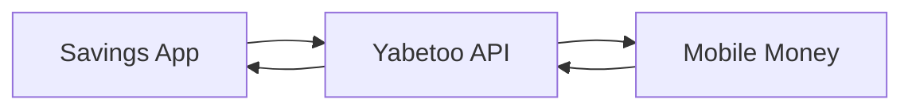

Learn how to build a digital savings vault application using Yabetoo, inspired by platforms like [SafeLock](https://safelock.website). This guide covers vault creation, deposits, scheduled unlocks, and withdrawal processing.

## Overview

Digital savings platforms need to handle:
- Goal-based savings vaults with lock periods
- Mobile money deposits
- Automatic and manual vault unlocks
- Withdrawal processing with fees
- Interest or rewards calculations
- Multi-vault management per user

## How SafeLock Works

SafeLock is a mobile-first financial management app that helps users save money through "vaults" - locked savings containers tied to personal goals with predetermined release dates. Key features include:

- **Goal Tracking**: Multiple vaults for different objectives
- **Mobile Money Integration**: MTN and Airtel Money support
- **Flexible Unlocking**: Auto-unlock at maturity or early withdrawal with fees
- **Offline Support**: Access accounts without internet

## Architecture



## Implementation

### 1. Data Models

Define vault and transaction structures:

```typescript
// types.ts
interface User {
  id: string;
  firstName: string;
  lastName: string;
  phone: string;
  operatorName: 'mtn' | 'airtel';
  email?: string;
  totalSavings: number;
  createdAt: Date;
}

interface Vault {
  id: string;
  userId: string;
  name: string;
  goal: string;
  targetAmount: number;
  currentAmount: number;
  currency: string;
  unlockDate: Date;
  status: 'active' | 'matured' | 'withdrawn' | 'cancelled';
  autoWithdraw: boolean;
  createdAt: Date;
  unlockedAt?: Date;
  withdrawnAt?: Date;
}

interface VaultTransaction {
  id: string;
  vaultId: string;
  userId: string;
  type: 'deposit' | 'withdrawal' | 'early_withdrawal' | 'interest';
  amount: number;
  fee: number;
  netAmount: number;
  paymentIntentId?: string;
  disbursementId?: string;
  status: 'pending' | 'completed' | 'failed';
  createdAt: Date;
}

// Fee configuration
const FEES = {
  EARLY_WITHDRAWAL_PERCENT: 3,  // 3% fee for early withdrawal
  MATURITY_WITHDRAWAL_PERCENT: 0, // No fee at maturity
  MINIMUM_DEPOSIT: 500,  // 500 XAF minimum
  MINIMUM_VAULT_PERIOD_DAYS: 7  // Minimum 7 days lock
};
```

### 2. Create Savings Vault

Allow users to create goal-based vaults:

```typescript
import Yabetoo from 'yabetoo';

const yabetoo = new Yabetoo(process.env.YABETOO_SECRET_KEY!);

async function createVault(
  userId: string,
  vaultData: {
    name: string;
    goal: string;
    targetAmount: number;
    unlockDate: Date;
    autoWithdraw: boolean;
    initialDeposit?: number;
  }
) {
  const user = await db.users.findById(userId);

  // Validate unlock date
  const minUnlockDate = new Date();
  minUnlockDate.setDate(minUnlockDate.getDate() + FEES.MINIMUM_VAULT_PERIOD_DAYS);

  if (vaultData.unlockDate < minUnlockDate) {
    throw new Error(`Vault must be locked for at least ${FEES.MINIMUM_VAULT_PERIOD_DAYS} days`);
  }

  // Create vault
  const vault: Vault = {
    id: generateVaultId(),
    userId,
    name: vaultData.name,
    goal: vaultData.goal,
    targetAmount: vaultData.targetAmount,
    currentAmount: 0,
    currency: 'XAF',
    unlockDate: vaultData.unlockDate,
    status: 'active',
    autoWithdraw: vaultData.autoWithdraw,
    createdAt: new Date()
  };

  await db.vaults.create(vault);

  // Handle initial deposit if provided
  let paymentIntent = null;
  if (vaultData.initialDeposit && vaultData.initialDeposit >= FEES.MINIMUM_DEPOSIT) {
    paymentIntent = await createDeposit(vault.id, vaultData.initialDeposit);
  }

  return { vault, paymentIntent };
}
```

### 3. Deposit to Vault

Process deposits via mobile money:

```typescript
async function createDeposit(vaultId: string, amount: number) {
  if (amount < FEES.MINIMUM_DEPOSIT) {
    throw new Error(`Minimum deposit is ${FEES.MINIMUM_DEPOSIT} XAF`);
  }

  const vault = await db.vaults.findById(vaultId);
  if (!vault) throw new Error('Vault not found');
  if (vault.status !== 'active') throw new Error('Vault is not active');

  const user = await db.users.findById(vault.userId);

  // Create payment intent
  const intent = await yabetoo.payments.create({
    amount,
    currency: 'XAF',
    description: `Deposit to ${vault.name}`,
    metadata: {
      vaultId,
      userId: vault.userId,
      vaultName: vault.name,
      type: 'vault_deposit'
    }
  });

  // Create pending transaction
  await db.vaultTransactions.create({
    id: generateTransactionId(),
    vaultId,
    userId: vault.userId,
    type: 'deposit',
    amount,
    fee: 0,
    netAmount: amount,
    paymentIntentId: intent.id,
    status: 'pending',
    createdAt: new Date()
  });

  return intent;
}

async function confirmDeposit(
  paymentIntentId: string,
  paymentMethod: {
    phone: string;
    operatorName: 'mtn' | 'airtel';
  }
) {
  const transaction = await db.vaultTransactions.findByPaymentIntent(paymentIntentId);
  const vault = await db.vaults.findById(transaction.vaultId);
  const user = await db.users.findById(vault.userId);

  const confirmation = await yabetoo.payments.confirm(paymentIntentId, {
    clientSecret: transaction.clientSecret,
    firstName: user.firstName,
    lastName: user.lastName,
    paymentMethodData: {
      type: 'momo',
      momo: {
        msisdn: paymentMethod.phone,
        country: 'cg',
        operatorName: paymentMethod.operatorName
      }
    }
  });

  return confirmation;
}
```

### 4. Webhook Handler for Deposits

Process successful deposits:

```typescript
app.post('/webhooks/yabetoo', async (req, res) => {
  const event = req.body;

  switch (event.type) {
    case 'payment_intent.succeeded':
      if (event.data.metadata.type === 'vault_deposit') {
        await handleDepositSuccess(event.data);
      }
      break;

    case 'payment_intent.failed':
      if (event.data.metadata.type === 'vault_deposit') {
        await handleDepositFailure(event.data);
      }
      break;

    case 'disbursement.completed':
      if (event.data.metadata?.type === 'vault_withdrawal') {
        await handleWithdrawalComplete(event.data);
      }
      break;
  }

  res.json({ received: true });
});

async function handleDepositSuccess(data: any) {
  const { vaultId, userId } = data.metadata;
  const amount = data.amount;

  // Update transaction
  await db.vaultTransactions.updateByPaymentIntent(data.id, {
    status: 'completed'
  });

  // Update vault balance
  await db.vaults.incrementAmount(vaultId, amount);

  // Update user total savings
  await db.users.incrementTotalSavings(userId, amount);

  // Get updated vault
  const vault = await db.vaults.findById(vaultId);

  // Send notification
  await sendNotification(userId, {
    type: 'deposit_success',
    title: 'Deposit Successful',
    message: `${amount} XAF has been added to your "${vault.name}" vault. New balance: ${vault.currentAmount} XAF`,
    vaultId
  });

  // Check if target reached
  if (vault.currentAmount >= vault.targetAmount) {
    await sendNotification(userId, {
      type: 'target_reached',
      title: 'Goal Reached! 🎉',
      message: `Congratulations! You've reached your savings goal for "${vault.name}"!`,
      vaultId
    });
  }
}
```

### 5. Vault Maturity Processing

Handle vault unlocks when maturity date is reached:

```typescript
// Run daily via cron job
async function processMaturedVaults() {
  const maturedVaults = await db.vaults.findMany({
    where: {
      status: 'active',
      unlockDate: { lte: new Date() }
    }
  });

  for (const vault of maturedVaults) {
    try {
      // Update vault status
      await db.vaults.update(vault.id, {
        status: 'matured',
        unlockedAt: new Date()
      });

      const user = await db.users.findById(vault.userId);

      // Notify user
      await sendNotification(vault.userId, {
        type: 'vault_matured',
        title: 'Vault Unlocked! 🔓',
        message: `Your "${vault.name}" vault is now unlocked! You can withdraw ${vault.currentAmount} XAF without any fees.`,
        vaultId: vault.id
      });

      // Process auto-withdrawal if enabled
      if (vault.autoWithdraw && vault.currentAmount > 0) {
        await processWithdrawal(vault.id, vault.currentAmount, false);
      }

    } catch (error) {
      console.error(`Failed to process matured vault ${vault.id}:`, error);
      await notifyAdminOfVaultError(vault.id, error);
    }
  }
}
```

### 6. Withdrawal Processing

Handle both maturity and early withdrawals:

```typescript
async function processWithdrawal(
  vaultId: string,
  amount: number,
  isEarly: boolean = false
) {
  const vault = await db.vaults.findById(vaultId);
  const user = await db.users.findById(vault.userId);

  if (amount > vault.currentAmount) {
    throw new Error('Insufficient vault balance');
  }

  // Check if early withdrawal
  const now = new Date();
  if (vault.status === 'active' && now < vault.unlockDate) {
    isEarly = true;
  }

  // Calculate fee
  const feePercent = isEarly
    ? FEES.EARLY_WITHDRAWAL_PERCENT
    : FEES.MATURITY_WITHDRAWAL_PERCENT;
  const fee = Math.round(amount * (feePercent / 100));
  const netAmount = amount - fee;

  // Create withdrawal transaction
  const transaction: VaultTransaction = {
    id: generateTransactionId(),
    vaultId,
    userId: vault.userId,
    type: isEarly ? 'early_withdrawal' : 'withdrawal',
    amount,
    fee,
    netAmount,
    status: 'pending',
    createdAt: new Date()
  };

  await db.vaultTransactions.create(transaction);

  // Process disbursement
  const disbursement = await yabetoo.disbursements.create({
    amount: netAmount,
    currency: 'XAF',
    firstName: user.firstName,
    lastName: user.lastName,
    paymentMethodData: {
      type: 'momo',
      momo: {
        msisdn: user.phone,
        country: 'cg',
        operatorName: user.operatorName
      }
    }
  });

  // Update transaction with disbursement ID
  await db.vaultTransactions.update(transaction.id, {
    disbursementId: disbursement.id
  });

  // Update vault
  await db.vaults.update(vaultId, {
    currentAmount: vault.currentAmount - amount,
    status: vault.currentAmount - amount === 0 ? 'withdrawn' : vault.status,
    withdrawnAt: vault.currentAmount - amount === 0 ? new Date() : undefined
  });

  // Update user total savings
  await db.users.decrementTotalSavings(vault.userId, amount);

  return { transaction, disbursement, fee, netAmount };
}
```

### 7. Dashboard Statistics

Provide users with savings insights:

```typescript
async function getUserDashboard(userId: string) {
  const user = await db.users.findById(userId);
  const vaults = await db.vaults.findByUser(userId);
  const transactions = await db.vaultTransactions.findByUser(userId);

  const activeVaults = vaults.filter(v => v.status === 'active');
  const maturedVaults = vaults.filter(v => v.status === 'matured');

  // Calculate statistics
  const totalDeposits = transactions
    .filter(t => t.type === 'deposit' && t.status === 'completed')
    .reduce((sum, t) => sum + t.amount, 0);

  const totalWithdrawals = transactions
    .filter(t => ['withdrawal', 'early_withdrawal'].includes(t.type) && t.status === 'completed')
    .reduce((sum, t) => sum + t.amount, 0);

  const totalFeesPaid = transactions
    .filter(t => t.status === 'completed')
    .reduce((sum, t) => sum + t.fee, 0);

  // Upcoming unlocks
  const upcomingUnlocks = activeVaults
    .filter(v => v.unlockDate > new Date())
    .sort((a, b) => a.unlockDate.getTime() - b.unlockDate.getTime())
    .slice(0, 5);

  // Progress towards goals
  const vaultProgress = activeVaults.map(vault => ({
    vaultId: vault.id,
    name: vault.name,
    goal: vault.goal,
    currentAmount: vault.currentAmount,
    targetAmount: vault.targetAmount,
    progressPercent: Math.round((vault.currentAmount / vault.targetAmount) * 100),
    daysUntilUnlock: Math.ceil(
      (vault.unlockDate.getTime() - Date.now()) / (1000 * 60 * 60 * 24)
    )
  }));

  return {
    summary: {
      totalSavings: user.totalSavings,
      activeVaults: activeVaults.length,
      maturedVaults: maturedVaults.length,
      totalDeposits,
      totalWithdrawals,
      totalFeesPaid
    },
    vaultProgress,
    upcomingUnlocks,
    recentTransactions: transactions.slice(0, 10)
  };
}
```

### 8. Savings Reminders

Encourage regular deposits:

```typescript
// Run weekly via cron job
async function sendSavingsReminders() {
  const users = await db.users.findAll();

  for (const user of users) {
    const activeVaults = await db.vaults.findActiveByUser(user.id);

    if (activeVaults.length === 0) continue;

    // Check for vaults below target with approaching unlock dates
    const urgentVaults = activeVaults.filter(vault => {
      const daysUntilUnlock = Math.ceil(
        (vault.unlockDate.getTime() - Date.now()) / (1000 * 60 * 60 * 24)
      );
      const progressPercent = (vault.currentAmount / vault.targetAmount) * 100;

      return daysUntilUnlock <= 30 && progressPercent < 80;
    });

    if (urgentVaults.length > 0) {
      for (const vault of urgentVaults) {
        const remaining = vault.targetAmount - vault.currentAmount;
        const daysLeft = Math.ceil(
          (vault.unlockDate.getTime() - Date.now()) / (1000 * 60 * 60 * 24)
        );

        await sendNotification(user.id, {
          type: 'savings_reminder',
          title: 'Savings Reminder 💰',
          message: `Your "${vault.name}" vault needs ${remaining} XAF more to reach your goal. You have ${daysLeft} days left!`,
          vaultId: vault.id
        });
      }
    }
  }
}
```

## User Flow

<Steps>
  <Step title="Create Account">
    User registers with phone number (MTN or Airtel).
  </Step>
  <Step title="Create Vault">
    User creates a savings vault with a goal, target amount, and unlock date.
  </Step>
  <Step title="Make Deposits">
    User deposits money via mobile money at any time.
  </Step>
  <Step title="Track Progress">
    User monitors progress towards savings goals in the app.
  </Step>
  <Step title="Vault Matures">
    When unlock date arrives, vault becomes available for withdrawal.
  </Step>
  <Step title="Withdraw">
    User withdraws funds to their mobile money account.
  </Step>
</Steps>

## Fee Structure

| Action | Fee |
|--------|-----|
| Deposit | Free |
| Withdrawal at maturity | Free |
| Early withdrawal | 3% |
| Account maintenance | Free |

## Best Practices

<AccordionGroup>
  <Accordion title="Savings Challenges">
    Create weekly or monthly savings challenges to encourage consistent deposits.
  </Accordion>
  <Accordion title="Social Features">
    Allow users to share progress (anonymously) to create accountability.
  </Accordion>
  <Accordion title="Flexible Goals">
    Let users adjust target amounts and dates if circumstances change.
  </Accordion>
  <Accordion title="Interest/Rewards">
    Consider offering small rewards for completing savings goals on time.
  </Accordion>
</AccordionGroup>

## Notification Templates

```typescript
const NOTIFICATION_TEMPLATES = {
  deposit_success: (amount: number, vaultName: string, balance: number) =>
    `✅ ${amount} XAF deposited to "${vaultName}". Balance: ${balance} XAF`,

  vault_matured: (vaultName: string, amount: number) =>
    `🔓 Your "${vaultName}" vault is unlocked! Withdraw ${amount} XAF fee-free.`,

  target_reached: (vaultName: string) =>
    `🎉 Goal reached for "${vaultName}"! Keep saving or wait for unlock.`,

  savings_reminder: (vaultName: string, remaining: number, days: number) =>
    `💰 "${vaultName}" needs ${remaining} XAF in ${days} days. Deposit now!`,

  early_withdrawal: (amount: number, fee: number, received: number) =>
    `⚠️ Early withdrawal: ${amount} XAF - ${fee} XAF fee = ${received} XAF sent.`
};
```

## Related Resources

<CardGroup cols={2}>
  <Card title="Payment Intents" icon="credit-card" href="/en/payments/api/overview">
    Learn about processing deposits
  </Card>
  <Card title="Disbursements" icon="money-bill-transfer" href="/en/payments/disbursement/overview">
    Handle withdrawals to users
  </Card>
</CardGroup>
