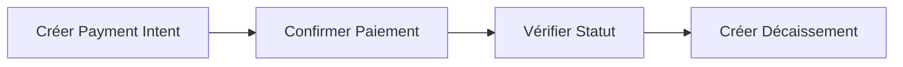

Commencez avec l'API Yabetoo en quelques minutes grâce à notre collection Postman officielle. Aucun code requis.

## Télécharger les fichiers

Téléchargez la collection et les fichiers d'environnement depuis notre dépôt GitHub :

<CardGroup cols={3}>
  <Card title="Collection API" icon="download" href="https://github.com/yabetoo/docs/raw/main/public/postman/Yabetoo-API.postman_collection.json">
    Tous les endpoints
  </Card>
  <Card title="Env Sandbox" icon="flask" href="https://github.com/yabetoo/docs/raw/main/public/postman/Yabetoo-Sandbox.postman_environment.json">
    Config test
  </Card>
  <Card title="Env Production" icon="rocket" href="https://github.com/yabetoo/docs/raw/main/public/postman/Yabetoo-Production.postman_environment.json">
    Config live
  </Card>
</CardGroup>

## Démarrage rapide

<Steps>
  <Step title="Télécharger les fichiers">
    Cliquez sur les boutons de téléchargement ci-dessus pour obtenir :
    - **Yabetoo-API.postman_collection.json** - La collection API principale
    - **Yabetoo-Sandbox.postman_environment.json** - Variables d'environnement Sandbox
  </Step>

  <Step title="Importer dans Postman">
    1. Ouvrez Postman
    2. Cliquez sur **Import** (en haut à gauche)
    3. Glissez-déposez les deux fichiers ou cliquez sur **Upload Files**
    4. Cliquez sur **Import**
  </Step>

  <Step title="Configurer votre clé API">
    1. Cliquez sur le menu déroulant **Environment** (en haut à droite)
    2. Sélectionnez **Yabetoo - Sandbox**
    3. Cliquez sur l'**icône œil** pour voir les variables
    4. Remplacez `sk_test_your_secret_key_here` par votre vraie clé de test
    5. Cliquez sur **Save**
  </Step>

  <Step title="Faire votre première requête">
    1. Ouvrez la collection **Yabetoo API**
    2. Naviguez vers **Payment Intent > Create Payment Intent**
    3. Cliquez sur **Send**
    4. Vous devriez recevoir une réponse `201` avec les détails de l'intention de paiement
  </Step>
</Steps>

## Contenu inclus

La collection couvre tous les endpoints de l'API Yabetoo :

| Dossier | Endpoints | Description |
|---------|-----------|-------------|
| **Checkout Session** | Create, Get | Pages de paiement hébergées |
| **Payment Intent** | Create, Confirm, Get | Intégration avancée des paiements |
| **Disbursement** | Create, Get | Envoi d'argent vers comptes mobile |
| **Remittance** | Create, Get, List | Transferts internationaux |
| **Webhook** | Create, Get, List | Notifications de paiement |

## Fonctionnalités

### Variables auto-sauvegardées

Quand vous créez une ressource, l'ID est automatiquement sauvegardé pour les requêtes suivantes :

```javascript
// Après la création d'une intention de paiement
pm.environment.set("payment_intent_id", response.id);

// La requête "Get Payment Intent" utilise automatiquement cet ID
GET /v1/payment_intents/{{payment_intent_id}}
```

### Tests intégrés

Chaque requête inclut une validation automatique :

```javascript
pm.test("Le code de statut est 201", function () {
    pm.response.to.have.status(201);
});

pm.test("La réponse contient les données", function () {
    var jsonData = pm.response.json();
    pm.expect(jsonData).to.have.property('id');
    pm.expect(jsonData).to.have.property('status');
});
```

### Exemples pré-remplis

Toutes les requêtes incluent des exemples réalistes :

```json
{
  "amount": 10000,
  "currency": "XAF",
  "description": "Paiement pour la commande #12345",
  "metadata": {
    "orderId": "12345",
    "productName": "Abonnement Premium"
  }
}
```

## Environnements

Nous fournissons deux configurations d'environnement :

<CardGroup cols={2}>
  <Card title="Sandbox" icon="flask">
    **Pour les tests**
    - URL : `api.sandbox.yabetoo.com`
    - Clés API de test (`sk_test_...`)
    - Aucun argent réel n'est transféré
  </Card>
  <Card title="Production" icon="rocket">
    **Pour les paiements réels**
    - URL : `api.yabetoo.com`
    - Clés API live (`sk_live_...`)
    - Transactions réelles
  </Card>
</CardGroup>

<Warning>
  Ne commitez jamais vos clés API dans le contrôle de version. Utilisez les variables d'environnement Postman pour les garder sécurisées.
</Warning>

## Workflow typique

Voici un workflow de test courant :



1. **Créer Payment Intent** - Initialiser un paiement
2. **Confirmer Paiement** - Ajouter les détails mobile money du client
3. **Vérifier Statut** - Interroger ou attendre le webhook
4. **Créer Décaissement** - Envoyer un paiement (si nécessaire)

## Numéros de téléphone de test

Utilisez ces numéros en mode sandbox :

| Numéro | Opérateur | Pays | Comportement |
|--------|-----------|------|--------------|
| `242066000001` | MTN | Congo | Toujours réussi |
| `242066000002` | MTN | Congo | Toujours échoue |
| `242055000001` | Airtel | Congo | Toujours réussi |

## Dépannage

<AccordionGroup>
  <Accordion title="401 Unauthorized">
    - Vérifiez que votre clé API est correctement définie dans l'environnement
    - Assurez-vous d'utiliser la bonne clé pour l'environnement (clé test pour sandbox)
    - Vérifiez que la clé n'a pas été révoquée dans votre dashboard
  </Accordion>

  <Accordion title="Variable non trouvée">
    - Assurez-vous d'avoir sélectionné un environnement (menu déroulant en haut à droite)
    - Exécutez la requête "Create" avant la requête "Get" pour auto-remplir les IDs
    - Vérifiez les variables d'environnement en cliquant sur l'icône œil
  </Accordion>

  <Accordion title="Erreur de certificat SSL">
    - Dans les paramètres Postman, désactivez "SSL certificate verification" pour les tests
    - Ceci ne devrait être fait que dans les environnements de développement
  </Accordion>
</AccordionGroup>


## Ressources connexes

<CardGroup cols={2}>
  <Card title="Référence API" icon="book" href="/fr/api-reference/introduction">
    Documentation API complète
  </Card>
  <Card title="Guide de test" icon="vial" href="/fr/developer-tools/test/overview">
    Mode test et détails du sandbox
  </Card>
</CardGroup>
