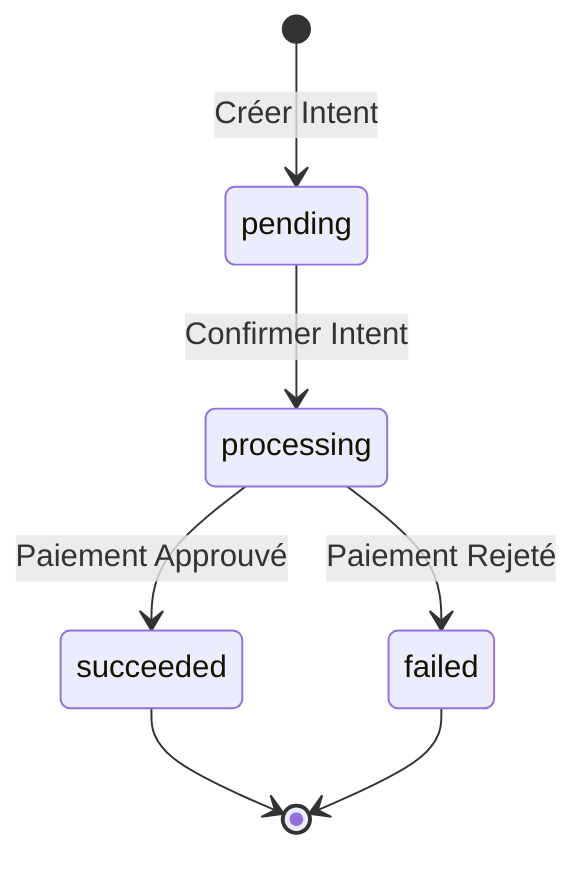

Ce guide explique tous les statuts que vous rencontrerez lors du travail avec les paiements, décaissements et transferts dans Yabetoo.

## Statuts des intentions de paiement

Une intention de paiement passe par plusieurs statuts au cours de son cycle de vie :

| Statut | Description | Prochaines étapes |
|--------|-------------|-------------------|
| `pending` | Intention créée, en attente de confirmation | Confirmer le paiement avec les détails du client |
| `processing` | Paiement en cours de traitement par le fournisseur Mobile Money | Attendre la fin |
| `succeeded` | Paiement effectué avec succès | Exécuter la commande |
| `failed` | Paiement échoué | Vérifier la raison de l'erreur, permettre de réessayer |

### Flux des statuts



## Statuts des sessions de paiement

| Statut | Description |
|--------|-------------|
| `pending` | Session créée, en attente de paiement |
| `complete` | Paiement effectué avec succès |
| `expired` | Session expirée sans paiement |
| `canceled` | Session annulée |

## Statuts des décaissements

Les décaissements (versements aux clients) ont les statuts suivants :

| Statut | Description |
|--------|-------------|
| `pending` | Décaissement créé, en file d'attente pour traitement |
| `processing` | En cours d'envoi au destinataire |
| `succeeded` | Argent envoyé avec succès au destinataire |
| `failed` | Décaissement échoué |

## Statuts des transferts

Les transferts (remittances) suivent le même schéma :

| Statut | Description |
|--------|-------------|
| `pending` | Transfert en file d'attente |
| `processing` | Transfert en cours |
| `succeeded` | Transfert terminé |
| `failed` | Transfert échoué |

## Gérer les différents statuts

### Paiements réussis

Lorsqu'un paiement atteint `succeeded` :

```javascript
if (payment.status === "succeeded") {
  // 1. Mettre à jour votre base de données
  await updateOrderStatus(orderId, "paid");

  // 2. Envoyer une confirmation au client
  await sendConfirmationEmail(customer.email);

  // 3. Déclencher l'exécution
  await fulfillOrder(orderId);
}
```

### Paiements échoués

Lorsqu'un paiement échoue, vérifiez le `failure_message` :

```javascript
if (payment.status === "failed") {
  const reason = payment.failure_message;

  switch (reason) {
    case "LOW_BALANCE":
      // Demander au client de recharger
      showMessage("Solde insuffisant. Veuillez recharger votre compte Mobile Money.");
      break;
    case "APPROVAL_REJECTED":
      // Le client a rejeté le paiement
      showMessage("Paiement annulé. Veuillez réessayer.");
      break;
    case "TIMEOUT":
      // Le client n'a pas répondu
      showMessage("Délai de paiement dépassé. Veuillez réessayer.");
      break;
    default:
      showMessage("Paiement échoué. Veuillez réessayer ou utiliser un autre numéro.");
  }
}
```

### Paiements en cours

Pendant qu'un paiement est en `processing` :

```javascript
if (payment.status === "processing") {
  // Afficher un état d'attente à l'utilisateur
  showMessage("En attente de la confirmation du paiement...");

  // Le client devrait recevoir une notification sur son téléphone
  // Ne pas permettre les soumissions en double
  disablePayButton();
}
```

## Messages d'échec

Lorsqu'un paiement échoue, le champ `failure_message` fournit des détails :

| Message | Description | Action recommandée |
|---------|-------------|-------------------|
| `INTERNAL_PROCESSING_ERROR` | Erreur système | Réessayer plus tard |
| `APPROVAL_REJECTED` | Le client a rejeté | Demander de réessayer |
| `EXPIRED` | Demande expirée | Créer une nouvelle intention |
| `TIMEOUT` | Pas de réponse du client | Demander de réessayer |
| `PAYEE_NOT_FOUND` | Numéro de téléphone invalide | Vérifier le numéro |
| `PAYEE_NOT_ALLOWED_TO_RECEIVE` | Le destinataire ne peut pas recevoir | Contacter le support |
| `NOT_ALLOWED` | Transaction bloquée | Contacter le support |
| `LOW_BALANCE_OR_PAYEE_LIMIT_REACHED_OR_NOT_ALLOWED` | Fonds insuffisants, limite de transaction atteinte, ou transaction non autorisée | Le client doit recharger ou contacter son opérateur |

## Événements Webhook par statut

| Statut | Événement Webhook |
|--------|-------------------|
| `succeeded` | `intent.completed` |
| `succeeded` (décaissement) | `disbursement.completed` |

## Bonnes pratiques

1. **Gérez toujours tous les statuts** - Ne supposez pas que les paiements réussiront toujours
2. **Utilisez les webhooks pour la fiabilité** - Ne vous fiez pas uniquement aux réponses synchrones
3. **Journalisez les changements de statut** - Gardez un historique pour le débogage et le support
4. **Affichez des messages clairs** - Aidez les utilisateurs à comprendre ce qui s'est passé et quoi faire ensuite
5. **Implémentez une logique de nouvelle tentative** - Permettez aux clients de réessayer les paiements échoués

<Note>
  Pour tester différents statuts, utilisez les [numéros de test](/fr/developer-tools/test/overview) dans l'environnement sandbox.
</Note>
