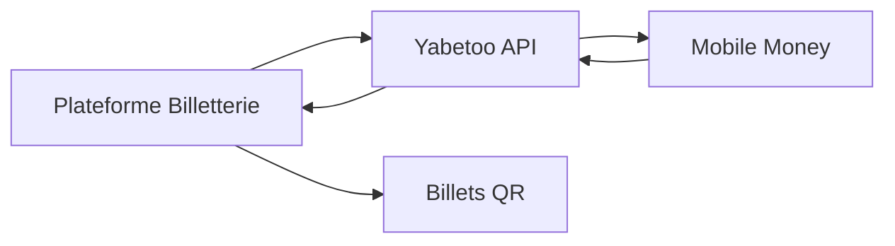

Apprenez à construire une plateforme de billetterie complète avec Yabetoo. Ce guide couvre la vente de billets, les différents types de billets, la gestion des capacités et la validation à l'entrée.

## Aperçu

Les plateformes de billetterie doivent gérer :
- Plusieurs types de billets et niveaux de prix
- Les tarifs early bird et promotionnels
- Les limites de capacité et la gestion des ruptures de stock
- La génération de QR codes
- La validation et le check-in des participants
- Le traitement des remboursements

## Architecture



## Implémentation

### 1. Configuration des événements et billets

Définissez la structure de vos événements :

```typescript
interface Event {
  id: string;
  name: string;
  description: string;
  venue: string;
  date: Date;
  imageUrl: string;
  organizerId: string;
  status: 'draft' | 'published' | 'soldout' | 'completed' | 'cancelled';
  ticketTypes: TicketType[];
}

interface TicketType {
  id: string;
  eventId: string;
  name: string;
  description: string;
  price: number;
  quantity: number;
  sold: number;
  maxPerOrder: number;
  salesStart: Date;
  salesEnd: Date;
  benefits: string[];
}

// Exemple d'événement
const sampleEvent: Event = {
  id: 'evt_concert_2024',
  name: 'Afrobeats Night 2024',
  description: 'Le plus grand concert Afrobeats de l\'année',
  venue: 'Palais des Congrès, Brazzaville',
  date: new Date('2024-12-31T20:00:00'),
  imageUrl: '/events/afrobeats-2024.jpg',
  organizerId: 'org_123',
  status: 'published',
  ticketTypes: [
    {
      id: 'tt_vip',
      eventId: 'evt_concert_2024',
      name: 'VIP',
      description: 'Places au premier rang avec accès backstage',
      price: 50000,
      quantity: 100,
      sold: 45,
      maxPerOrder: 4,
      salesStart: new Date('2024-10-01'),
      salesEnd: new Date('2024-12-30'),
      benefits: ['Places au premier rang', 'Accès backstage', 'Meet & greet', 'Boissons offertes']
    },
    {
      id: 'tt_standard',
      eventId: 'evt_concert_2024',
      name: 'Standard',
      description: 'Entrée générale',
      price: 15000,
      quantity: 500,
      sold: 320,
      maxPerOrder: 10,
      salesStart: new Date('2024-10-01'),
      salesEnd: new Date('2024-12-30'),
      benefits: ['Entrée générale', 'Zone debout']
    }
  ]
};
```

### 2. Achat de billets

Gérer les commandes de billets :

```typescript
import Yabetoo from 'yabetoo';

const yabetoo = new Yabetoo(process.env.YABETOO_SECRET_KEY!);

async function createTicketOrder(
  eventId: string,
  items: { ticketTypeId: string; quantity: number }[],
  buyerInfo: { firstName: string; lastName: string; email: string; phone: string }
) {
  const event = await db.events.findById(eventId);

  // Valider la disponibilité
  for (const item of items) {
    const ticketType = event.ticketTypes.find(t => t.id === item.ticketTypeId);
    const available = ticketType.quantity - ticketType.sold;

    if (item.quantity > available) {
      throw new Error(`Seulement ${available} billets disponibles pour ${ticketType.name}`);
    }
  }

  // Calculer le total
  const totalAmount = items.reduce((sum, item) => {
    const ticketType = event.ticketTypes.find(t => t.id === item.ticketTypeId)!;
    return sum + (ticketType.price * item.quantity);
  }, 0);

  // Créer l'intention de paiement
  const intent = await yabetoo.payments.create({
    amount: totalAmount,
    currency: 'XAF',
    description: `Billets pour ${event.name}`,
    metadata: {
      orderId: generateOrderId(),
      eventId,
      eventName: event.name,
      eventDate: event.date.toISOString(),
      ticketDetails: JSON.stringify(items),
      buyerEmail: buyerInfo.email,
      buyerPhone: buyerInfo.phone,
      type: 'event_ticket'
    }
  });

  return intent;
}
```

### 3. Génération des billets QR Code

Générer des QR codes uniques pour chaque billet :

```typescript
import QRCode from 'qrcode';
import crypto from 'crypto';

async function generateTickets(order: Order, event: Event): Promise<Ticket[]> {
  const tickets: Ticket[] = [];

  for (const item of order.items) {
    const ticketType = event.ticketTypes.find(t => t.id === item.ticketTypeId)!;

    for (let i = 0; i < item.quantity; i++) {
      const ticketId = `TKT-${Date.now()}-${crypto.randomBytes(4).toString('hex').toUpperCase()}`;

      // Créer les données QR sécurisées
      const qrData = {
        ticketId,
        eventId: event.id,
        ticketTypeId: item.ticketTypeId,
        timestamp: Date.now(),
        signature: crypto
          .createHmac('sha256', process.env.TICKET_SECRET!)
          .update(`${ticketId}:${event.id}`)
          .digest('hex')
      };

      const qrCodeImage = await QRCode.toDataURL(JSON.stringify(qrData), {
        width: 300,
        margin: 2,
        color: { dark: '#001C6B', light: '#FFFFFF' }
      });

      tickets.push({
        id: ticketId,
        orderId: order.id,
        eventId: event.id,
        ticketTypeId: item.ticketTypeId,
        ticketTypeName: ticketType.name,
        holderName: `${order.buyerInfo.firstName} ${order.buyerInfo.lastName}`,
        qrCode: qrCodeImage,
        status: 'valid'
      });
    }
  }

  await db.tickets.createMany(tickets);
  return tickets;
}
```

### 4. Validation des billets (Check-in)

Valider les billets à l'entrée de l'événement :

```typescript
async function validateTicket(qrCodeData: string) {
  const data = JSON.parse(qrCodeData);

  // Vérifier la signature
  const expectedSignature = crypto
    .createHmac('sha256', process.env.TICKET_SECRET!)
    .update(`${data.ticketId}:${data.eventId}`)
    .digest('hex');

  if (data.signature !== expectedSignature) {
    return { valid: false, message: 'Signature du billet invalide' };
  }

  const ticket = await db.tickets.findById(data.ticketId);

  if (!ticket) {
    return { valid: false, message: 'Billet non trouvé' };
  }

  if (ticket.status === 'used') {
    return { valid: false, message: `Billet déjà utilisé le ${ticket.usedAt}` };
  }

  // Marquer comme utilisé
  await db.tickets.update(ticket.id, {
    status: 'used',
    usedAt: new Date()
  });

  return {
    valid: true,
    ticket,
    message: 'Billet validé avec succès',
    ticketType: ticket.ticketTypeName
  };
}
```

### 5. Traitement des remboursements

Gérer les remboursements de billets :

```typescript
async function processRefund(orderId: string, reason: string) {
  const order = await db.orders.findById(orderId);
  const event = await db.events.findById(order.eventId);

  // Vérifier la politique de remboursement (ex: pas de remboursement 48h avant)
  const hoursUntilEvent = (event.date.getTime() - Date.now()) / (1000 * 60 * 60);
  if (hoursUntilEvent < 48) {
    throw new Error('Remboursements non disponibles dans les 48h précédant l\'événement');
  }

  // Annuler les billets
  await db.tickets.updateMany({ orderId }, { status: 'cancelled' });

  // Créer le décaissement pour le remboursement
  const disbursement = await yabetoo.disbursements.create({
    amount: order.totalAmount,
    currency: 'XAF',
    firstName: order.buyerInfo.firstName,
    lastName: order.buyerInfo.lastName,
    paymentMethodData: {
      type: 'momo',
      momo: {
        msisdn: order.buyerInfo.phone,
        country: 'cg',
        operatorName: 'mtn'
      }
    }
  });

  return disbursement;
}
```

## Flux d'achat de billets

<Steps>
  <Step title="Parcourir les événements">
    L'utilisateur parcourt les événements disponibles et en sélectionne un.
  </Step>
  <Step title="Sélectionner les billets">
    L'utilisateur choisit le type de billet et la quantité.
  </Step>
  <Step title="Saisir les coordonnées">
    L'utilisateur fournit ses informations (nom, email, téléphone).
  </Step>
  <Step title="Paiement">
    L'utilisateur paie via mobile money (MTN ou Airtel).
  </Step>
  <Step title="Recevoir les billets">
    L'utilisateur reçoit ses billets avec QR code par email et SMS.
  </Step>
  <Step title="Jour de l'événement">
    L'utilisateur présente le QR code à l'entrée pour le scan et l'accès.
  </Step>
</Steps>

## Bonnes pratiques

<AccordionGroup>
  <Accordion title="Réservation de billets">
    Bloquez les billets 15 minutes pendant le checkout pour éviter la survente.
  </Accordion>
  <Accordion title="Prévention de la fraude">
    Utilisez des signatures cryptographiques sur les QR codes pour prévenir la contrefaçon.
  </Accordion>
  <Accordion title="Check-in hors ligne">
    Supportez la validation des billets hors ligne avec synchronisation périodique.
  </Accordion>
  <Accordion title="Alertes de capacité">
    Envoyez des alertes aux organisateurs quand les billets sont vendus à 80%, 95% et 100%.
  </Accordion>
</AccordionGroup>

## Ressources associées

<CardGroup cols={2}>
  <Card title="Décaissements" icon="money-bill-transfer" href="/fr/payments/disbursement/overview">
    Traiter les remboursements clients
  </Card>
  <Card title="Webhooks" icon="webhook" href="/fr/developer-tools/webhook/overview">
    Gérer les notifications de paiement
  </Card>
</CardGroup>
