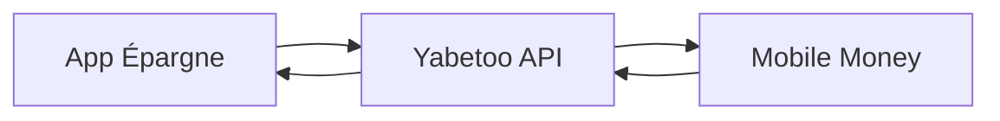

Apprenez à construire une application de coffre-fort d'épargne numérique avec Yabetoo, inspirée de plateformes comme [SafeLock](https://safelock.website). Ce guide couvre la création de coffres, les dépôts, les déblocages programmés et le traitement des retraits.

## Aperçu

Les plateformes d'épargne numériques doivent gérer :
- Des coffres d'épargne par objectifs avec périodes de blocage
- Les dépôts via mobile money
- Les déblocages automatiques et manuels
- Le traitement des retraits avec frais
- Les calculs d'intérêts ou récompenses
- La gestion multi-coffres par utilisateur

## Comment fonctionne SafeLock

SafeLock est une application mobile de gestion financière qui aide les utilisateurs à épargner grâce à des "coffres" - des conteneurs d'épargne verrouillés liés à des objectifs personnels avec des dates de déblocage prédéfinies. Fonctionnalités clés :

- **Suivi des objectifs** : Plusieurs coffres pour différents objectifs
- **Intégration Mobile Money** : Support MTN et Airtel Money
- **Déblocage flexible** : Déblocage auto à maturité ou retrait anticipé avec frais
- **Support hors ligne** : Accès au compte sans internet

## Architecture



## Implémentation

### 1. Modèles de données

Définissez les structures de coffres et transactions :

```typescript
interface Vault {
  id: string;
  userId: string;
  name: string;
  goal: string;
  targetAmount: number;
  currentAmount: number;
  currency: string;
  unlockDate: Date;
  status: 'active' | 'matured' | 'withdrawn' | 'cancelled';
  autoWithdraw: boolean;
  createdAt: Date;
  unlockedAt?: Date;
  withdrawnAt?: Date;
}

interface VaultTransaction {
  id: string;
  vaultId: string;
  userId: string;
  type: 'deposit' | 'withdrawal' | 'early_withdrawal' | 'interest';
  amount: number;
  fee: number;
  netAmount: number;
  paymentIntentId?: string;
  disbursementId?: string;
  status: 'pending' | 'completed' | 'failed';
  createdAt: Date;
}

// Configuration des frais
const FEES = {
  EARLY_WITHDRAWAL_PERCENT: 3,  // 3% de frais pour retrait anticipé
  MATURITY_WITHDRAWAL_PERCENT: 0, // Pas de frais à maturité
  MINIMUM_DEPOSIT: 500,  // 500 XAF minimum
  MINIMUM_VAULT_PERIOD_DAYS: 7  // Minimum 7 jours de blocage
};
```

### 2. Créer un coffre d'épargne

Permettre aux utilisateurs de créer des coffres par objectif :

```typescript
import Yabetoo from 'yabetoo';

const yabetoo = new Yabetoo(process.env.YABETOO_SECRET_KEY!);

async function createVault(
  userId: string,
  vaultData: {
    name: string;
    goal: string;
    targetAmount: number;
    unlockDate: Date;
    autoWithdraw: boolean;
    initialDeposit?: number;
  }
) {
  const user = await db.users.findById(userId);

  // Valider la date de déblocage
  const minUnlockDate = new Date();
  minUnlockDate.setDate(minUnlockDate.getDate() + FEES.MINIMUM_VAULT_PERIOD_DAYS);

  if (vaultData.unlockDate < minUnlockDate) {
    throw new Error(`Le coffre doit être bloqué au moins ${FEES.MINIMUM_VAULT_PERIOD_DAYS} jours`);
  }

  // Créer le coffre
  const vault: Vault = {
    id: generateVaultId(),
    userId,
    name: vaultData.name,
    goal: vaultData.goal,
    targetAmount: vaultData.targetAmount,
    currentAmount: 0,
    currency: 'XAF',
    unlockDate: vaultData.unlockDate,
    status: 'active',
    autoWithdraw: vaultData.autoWithdraw,
    createdAt: new Date()
  };

  await db.vaults.create(vault);

  // Gérer le dépôt initial si fourni
  let paymentIntent = null;
  if (vaultData.initialDeposit && vaultData.initialDeposit >= FEES.MINIMUM_DEPOSIT) {
    paymentIntent = await createDeposit(vault.id, vaultData.initialDeposit);
  }

  return { vault, paymentIntent };
}
```

### 3. Dépôt sur un coffre

Traiter les dépôts via mobile money :

```typescript
async function createDeposit(vaultId: string, amount: number) {
  if (amount < FEES.MINIMUM_DEPOSIT) {
    throw new Error(`Dépôt minimum: ${FEES.MINIMUM_DEPOSIT} XAF`);
  }

  const vault = await db.vaults.findById(vaultId);
  if (vault.status !== 'active') throw new Error('Le coffre n\'est pas actif');

  const user = await db.users.findById(vault.userId);

  // Créer l'intention de paiement
  const intent = await yabetoo.payments.create({
    amount,
    currency: 'XAF',
    description: `Dépôt vers ${vault.name}`,
    metadata: {
      vaultId,
      userId: vault.userId,
      vaultName: vault.name,
      type: 'vault_deposit'
    }
  });

  // Créer la transaction en attente
  await db.vaultTransactions.create({
    id: generateTransactionId(),
    vaultId,
    userId: vault.userId,
    type: 'deposit',
    amount,
    fee: 0,
    netAmount: amount,
    paymentIntentId: intent.id,
    status: 'pending',
    createdAt: new Date()
  });

  return intent;
}
```

### 4. Gestionnaire Webhook pour les dépôts

Traiter les dépôts réussis :

```typescript
app.post('/webhooks/yabetoo', async (req, res) => {
  const event = req.body;

  if (event.type === 'payment_intent.succeeded') {
    if (event.data.metadata.type === 'vault_deposit') {
      await handleDepositSuccess(event.data);
    }
  }

  res.json({ received: true });
});

async function handleDepositSuccess(data: any) {
  const { vaultId, userId } = data.metadata;
  const amount = data.amount;

  // Mettre à jour la transaction
  await db.vaultTransactions.updateByPaymentIntent(data.id, {
    status: 'completed'
  });

  // Mettre à jour le solde du coffre
  await db.vaults.incrementAmount(vaultId, amount);

  // Mettre à jour l'épargne totale de l'utilisateur
  await db.users.incrementTotalSavings(userId, amount);

  const vault = await db.vaults.findById(vaultId);

  // Envoyer notification
  await sendNotification(userId, {
    type: 'deposit_success',
    title: 'Dépôt réussi',
    message: `${amount} XAF ajoutés à votre coffre "${vault.name}". Nouveau solde: ${vault.currentAmount} XAF`,
    vaultId
  });

  // Vérifier si l'objectif est atteint
  if (vault.currentAmount >= vault.targetAmount) {
    await sendNotification(userId, {
      type: 'target_reached',
      title: 'Objectif atteint ! 🎉',
      message: `Félicitations ! Vous avez atteint votre objectif d'épargne pour "${vault.name}" !`,
      vaultId
    });
  }
}
```

### 5. Traitement de la maturité des coffres

Gérer les déblocages quand la date de maturité est atteinte :

```typescript
// Exécuté quotidiennement via cron
async function processMaturedVaults() {
  const maturedVaults = await db.vaults.findMany({
    where: {
      status: 'active',
      unlockDate: { lte: new Date() }
    }
  });

  for (const vault of maturedVaults) {
    // Mettre à jour le statut
    await db.vaults.update(vault.id, {
      status: 'matured',
      unlockedAt: new Date()
    });

    // Notifier l'utilisateur
    await sendNotification(vault.userId, {
      type: 'vault_matured',
      title: 'Coffre débloqué ! 🔓',
      message: `Votre coffre "${vault.name}" est maintenant débloqué ! Vous pouvez retirer ${vault.currentAmount} XAF sans frais.`,
      vaultId: vault.id
    });

    // Traiter le retrait automatique si activé
    if (vault.autoWithdraw && vault.currentAmount > 0) {
      await processWithdrawal(vault.id, vault.currentAmount, false);
    }
  }
}
```

### 6. Traitement des retraits

Gérer les retraits à maturité et anticipés :

```typescript
async function processWithdrawal(
  vaultId: string,
  amount: number,
  isEarly: boolean = false
) {
  const vault = await db.vaults.findById(vaultId);
  const user = await db.users.findById(vault.userId);

  if (amount > vault.currentAmount) {
    throw new Error('Solde insuffisant dans le coffre');
  }

  // Vérifier si retrait anticipé
  if (vault.status === 'active' && new Date() < vault.unlockDate) {
    isEarly = true;
  }

  // Calculer les frais
  const feePercent = isEarly
    ? FEES.EARLY_WITHDRAWAL_PERCENT
    : FEES.MATURITY_WITHDRAWAL_PERCENT;
  const fee = Math.round(amount * (feePercent / 100));
  const netAmount = amount - fee;

  // Créer la transaction de retrait
  const transaction = {
    id: generateTransactionId(),
    vaultId,
    userId: vault.userId,
    type: isEarly ? 'early_withdrawal' : 'withdrawal',
    amount,
    fee,
    netAmount,
    status: 'pending',
    createdAt: new Date()
  };

  await db.vaultTransactions.create(transaction);

  // Traiter le décaissement
  const disbursement = await yabetoo.disbursements.create({
    amount: netAmount,
    currency: 'XAF',
    firstName: user.firstName,
    lastName: user.lastName,
    paymentMethodData: {
      type: 'momo',
      momo: {
        msisdn: user.phone,
        country: 'cg',
        operatorName: user.operatorName
      }
    }
  });

  // Mettre à jour le coffre
  await db.vaults.update(vaultId, {
    currentAmount: vault.currentAmount - amount,
    status: vault.currentAmount - amount === 0 ? 'withdrawn' : vault.status
  });

  return { transaction, disbursement, fee, netAmount };
}
```

### 7. Statistiques du tableau de bord

Fournir aux utilisateurs des insights sur leur épargne :

```typescript
async function getUserDashboard(userId: string) {
  const user = await db.users.findById(userId);
  const vaults = await db.vaults.findByUser(userId);
  const transactions = await db.vaultTransactions.findByUser(userId);

  const activeVaults = vaults.filter(v => v.status === 'active');

  // Progression vers les objectifs
  const vaultProgress = activeVaults.map(vault => ({
    vaultId: vault.id,
    name: vault.name,
    goal: vault.goal,
    currentAmount: vault.currentAmount,
    targetAmount: vault.targetAmount,
    progressPercent: Math.round((vault.currentAmount / vault.targetAmount) * 100),
    daysUntilUnlock: Math.ceil(
      (vault.unlockDate.getTime() - Date.now()) / (1000 * 60 * 60 * 24)
    )
  }));

  return {
    summary: {
      totalSavings: user.totalSavings,
      activeVaults: activeVaults.length,
      totalDeposits: transactions.filter(t => t.type === 'deposit' && t.status === 'completed').reduce((s, t) => s + t.amount, 0)
    },
    vaultProgress,
    recentTransactions: transactions.slice(0, 10)
  };
}
```

## Flux utilisateur

<Steps>
  <Step title="Créer un compte">
    L'utilisateur s'inscrit avec son numéro de téléphone (MTN ou Airtel).
  </Step>
  <Step title="Créer un coffre">
    L'utilisateur crée un coffre d'épargne avec un objectif, un montant cible et une date de déblocage.
  </Step>
  <Step title="Effectuer des dépôts">
    L'utilisateur dépose de l'argent via mobile money à tout moment.
  </Step>
  <Step title="Suivre la progression">
    L'utilisateur surveille sa progression vers ses objectifs dans l'app.
  </Step>
  <Step title="Maturité du coffre">
    Quand la date de déblocage arrive, le coffre devient disponible pour retrait.
  </Step>
  <Step title="Retirer">
    L'utilisateur retire les fonds vers son compte mobile money.
  </Step>
</Steps>

## Structure des frais

| Action | Frais |
|--------|-------|
| Dépôt | Gratuit |
| Retrait à maturité | Gratuit |
| Retrait anticipé | 3% |
| Maintenance compte | Gratuit |

## Bonnes pratiques

<AccordionGroup>
  <Accordion title="Défis d'épargne">
    Créez des défis hebdomadaires ou mensuels pour encourager les dépôts réguliers.
  </Accordion>
  <Accordion title="Fonctionnalités sociales">
    Permettez aux utilisateurs de partager leur progression (anonymement) pour créer de la responsabilité.
  </Accordion>
  <Accordion title="Objectifs flexibles">
    Laissez les utilisateurs ajuster les montants cibles et les dates si les circonstances changent.
  </Accordion>
  <Accordion title="Intérêts/Récompenses">
    Envisagez d'offrir de petites récompenses pour les objectifs atteints à temps.
  </Accordion>
</AccordionGroup>

## Modèles de notifications

```typescript
const NOTIFICATION_TEMPLATES = {
  deposit_success: (amount: number, vaultName: string, balance: number) =>
    `✅ ${amount} XAF déposés dans "${vaultName}". Solde: ${balance} XAF`,

  vault_matured: (vaultName: string, amount: number) =>
    `🔓 Votre coffre "${vaultName}" est débloqué ! Retirez ${amount} XAF sans frais.`,

  target_reached: (vaultName: string) =>
    `🎉 Objectif atteint pour "${vaultName}" ! Continuez ou attendez le déblocage.`,

  savings_reminder: (vaultName: string, remaining: number, days: number) =>
    `💰 "${vaultName}" a besoin de ${remaining} XAF dans ${days} jours. Déposez maintenant !`
};
```

## Ressources associées

<CardGroup cols={2}>
  <Card title="Intentions de paiement" icon="credit-card" href="/fr/payments/api/overview">
    Apprenez à traiter les dépôts
  </Card>
  <Card title="Décaissements" icon="money-bill-transfer" href="/fr/payments/disbursement/overview">
    Gérer les retraits vers les utilisateurs
  </Card>
</CardGroup>
