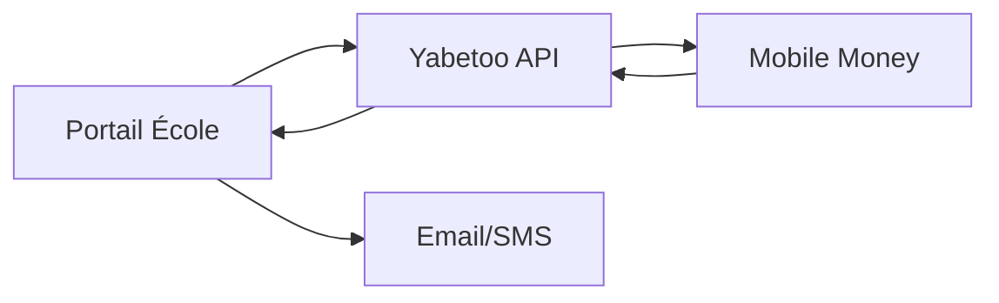

Apprenez à implémenter un système complet de collecte des frais de scolarité avec Yabetoo. Ce guide couvre les paiements de scolarité, les plans de paiement échelonné, les différents types de frais et les notifications aux parents.

## Aperçu

Les établissements éducatifs ont besoin de solutions de paiement pour gérer :
- La collecte des frais de scolarité
- Les frais d'inscription et d'immatriculation
- Les frais d'examen et de certification
- Les plans de paiement échelonné
- Plusieurs élèves par famille
- Les reçus de paiement et le reporting

## Architecture



## Implémentation

### 1. Définir la structure des frais

Configurez les catégories de frais de votre école :

```typescript
// fee-structure.ts
export interface FeeType {
  id: string;
  name: string;
  amount: number;
  category: 'tuition' | 'registration' | 'exam' | 'materials' | 'other';
  mandatory: boolean;
  academicYear: string;
}

export const FEE_STRUCTURE: Record<string, FeeType[]> = {
  'primaire': [
    { id: 'tuition-primary', name: 'Frais de scolarité', amount: 150000, category: 'tuition', mandatory: true, academicYear: '2024-2025' },
    { id: 'registration', name: 'Frais d\'inscription', amount: 25000, category: 'registration', mandatory: true, academicYear: '2024-2025' },
    { id: 'exam-fee', name: 'Frais d\'examen', amount: 15000, category: 'exam', mandatory: true, academicYear: '2024-2025' },
    { id: 'materials', name: 'Fournitures scolaires', amount: 35000, category: 'materials', mandatory: false, academicYear: '2024-2025' }
  ],
  'secondaire': [
    { id: 'tuition-secondary', name: 'Frais de scolarité', amount: 250000, category: 'tuition', mandatory: true, academicYear: '2024-2025' },
    { id: 'registration', name: 'Frais d\'inscription', amount: 35000, category: 'registration', mandatory: true, academicYear: '2024-2025' },
    { id: 'exam-fee', name: 'Frais d\'examen', amount: 25000, category: 'exam', mandatory: true, academicYear: '2024-2025' },
    { id: 'lab-fee', name: 'Frais de laboratoire', amount: 20000, category: 'materials', mandatory: true, academicYear: '2024-2025' }
  ]
};
```

### 2. Créer un paiement de frais

Permettre aux parents de payer les frais :

```typescript
import Yabetoo from '@yabetoo/sdk-js';

const yabetoo = new Yabetoo(process.env.YABETOO_SECRET_KEY!);

async function createFeePayment(
  studentId: string,
  feeIds: string[],
  parentInfo: { firstName: string; lastName: string; phone: string; email?: string }
) {
  const student = await db.students.findById(studentId);
  const fees = FEE_STRUCTURE[student.level].filter(f => feeIds.includes(f.id));

  const totalAmount = fees.reduce((sum, fee) => sum + fee.amount, 0);

  const intent = await yabetoo.payments.create({
    amount: totalAmount,
    currency: 'XAF',
    description: `Frais de scolarité pour ${student.firstName} ${student.lastName}`,
    metadata: {
      studentId,
      studentName: `${student.firstName} ${student.lastName}`,
      class: student.class,
      academicYear: student.academicYear,
      feeIds: feeIds.join(','),
      feeDetails: JSON.stringify(fees.map(f => ({ id: f.id, name: f.name, amount: f.amount }))),
      parentPhone: parentInfo.phone,
      parentEmail: parentInfo.email,
      type: 'school_fee'
    }
  });

  return intent;
}
```

### 3. Plans de paiement échelonné

Supporter le paiement en plusieurs fois :

```typescript
const INSTALLMENT_PLANS = [
  {
    id: 'full',
    name: 'Paiement intégral',
    installments: 1,
    schedule: [{ dueDate: new Date('2024-09-01'), percentage: 100 }]
  },
  {
    id: 'trimester',
    name: 'Plan trimestriel (3 paiements)',
    installments: 3,
    schedule: [
      { dueDate: new Date('2024-09-01'), percentage: 40 },
      { dueDate: new Date('2024-12-01'), percentage: 30 },
      { dueDate: new Date('2025-03-01'), percentage: 30 }
    ]
  },
  {
    id: 'monthly',
    name: 'Plan mensuel (10 paiements)',
    installments: 10,
    schedule: Array.from({ length: 10 }, (_, i) => ({
      dueDate: new Date(2024, 8 + i, 1),
      percentage: 10
    }))
  }
];
```

### 4. Gestionnaire Webhook

Traiter les confirmations de paiement :

```typescript
app.post('/webhooks/yabetoo', async (req, res) => {
  const event = req.body;

  if (event.type === 'payment_intent.succeeded') {
    const { metadata, amount } = event.data;

    if (metadata.type === 'school_fee') {
      // Enregistrer le paiement
      await db.payments.create({
        studentId: metadata.studentId,
        amount,
        paymentIntentId: event.data.id,
        feeIds: metadata.feeIds.split(','),
        status: 'succeeded',
        paidAt: new Date()
      });

      // Mettre à jour le compte étudiant
      await updateStudentBalance(metadata.studentId);

      // Générer et envoyer le reçu
      const receipt = await generateReceipt(event.data);
      await sendReceiptByEmail(metadata.parentEmail, receipt);
      await sendReceiptBySMS(metadata.parentPhone, receipt.summary);
    }
  }

  res.json({ received: true });
});
```

## Flux de paiement

<Steps>
  <Step title="Le parent accède au portail">
    Le parent se connecte au portail de l'école et consulte le compte de frais de son enfant.
  </Step>
  <Step title="Sélection des frais à payer">
    Le parent sélectionne les frais à régler (montant total ou éléments spécifiques).
  </Step>
  <Step title="Choix du plan de paiement">
    Le parent choisit le paiement intégral ou un plan échelonné.
  </Step>
  <Step title="Saisie des informations de paiement">
    Le parent saisit son numéro mobile money (MTN ou Airtel).
  </Step>
  <Step title="Confirmation du paiement">
    Le parent confirme le paiement sur son téléphone.
  </Step>
  <Step title="Réception du reçu">
    Le parent reçoit un reçu officiel par email et SMS.
  </Step>
  <Step title="Mise à jour du compte">
    Le compte de frais de l'élève est mis à jour automatiquement.
  </Step>
</Steps>

## Bonnes pratiques

<AccordionGroup>
  <Accordion title="Rappels de paiement">
    Envoyez des rappels automatiques avant les échéances (7 jours, 3 jours, 1 jour avant).
  </Accordion>
  <Accordion title="Réduction fratrie">
    Implémentez des réductions pour les familles avec plusieurs enfants inscrits.
  </Accordion>
  <Accordion title="Frais de retard">
    Prévoyez des périodes de grâce avant d'appliquer des pénalités de retard.
  </Accordion>
  <Accordion title="Intégration des bourses">
    Supportez les déductions de bourses et d'aides financières.
  </Accordion>
</AccordionGroup>

## Modèles de SMS

```typescript
const SMS_TEMPLATES = {
  paymentReceived: (data: any) =>
    `Paiement reçu. Montant: ${data.amount} XAF pour ${data.studentName}. Reçu: ${data.receiptNumber}. Solde: ${data.balance} XAF.`,

  installmentReminder: (data: any) =>
    `Rappel: Échéance ${data.number}/${data.total} (${data.amount} XAF) pour ${data.studentName} due le ${data.dueDate}. Payez via le portail.`,

  overdueNotice: (data: any) =>
    `Avis: Solde impayé de ${data.balance} XAF pour ${data.studentName}. Veuillez régulariser.`
};
```

## Ressources associées

<CardGroup cols={2}>
  <Card title="Checkout hébergé" icon="browser" href="/fr/payments/checkout-page/intro">
    Utilisez le checkout hébergé pour une intégration simplifiée
  </Card>
  <Card title="Webhooks" icon="webhook" href="/fr/developer-tools/webhook/overview">
    Configurez les notifications de paiement
  </Card>
</CardGroup>
